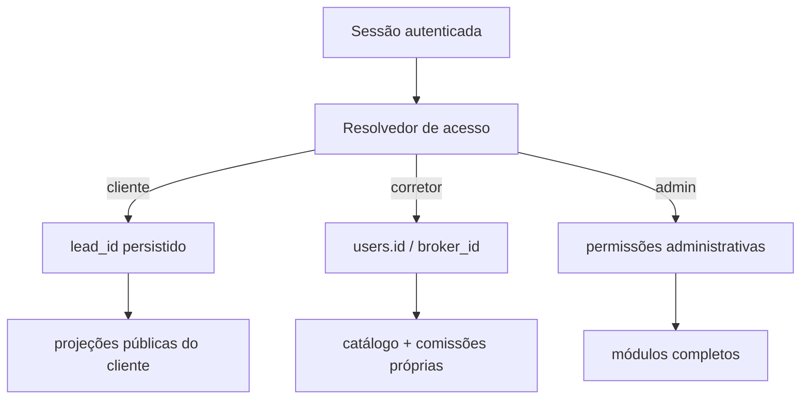

# Arquitetura proposta — EPIC-016

**Status:** Draft — decisão técnica ainda não implementada

## Avaliação AIOX de complexidade

| Dimensão | Nota | Justificativa |
|---|---:|---|
| Escopo | 5 | navegação, dois portais, quatro domínios operacionais e ecossistema Prospecta |
| Integrações | 5 | autenticação, CRM, Obras, Financiamentos, Imóveis, Comissões e storage |
| Infraestrutura/dados | 4 | migration, conciliação legada, uploads e dois bancos separados |
| Conhecimento | 3 | padrões já existem, mas estão distribuídos e parcialmente divergentes |
| Risco | 5 | exposição cruzada de dados pessoais/financeiros se o escopo falhar |
| **Total** | **22/25** | requer Spec/Architecture antes do desenvolvimento |

## Baseline confirmado

- `users.role` possui um papel principal: `admin`, `corretor`, `colaborador` ou `cliente`.
- `users.lead_id` já vincula a conta cliente ao lead.
- `construction_projects` possui `lead_id`, `lead_service_id` e o legado `user_id`.
- `financiamentos` possui `lead_id`, `lead_service_id` e `corretor_id`.
- `operational_commissions` possui `broker_id`; `broker_commissions` legado possui apenas nome.
- o Portal do Cliente já deriva o lead da sessão para atividades, visitas, contratos e chat.
- a tela antiga `/obras` usa `user_id` e ainda permite criar/editar/excluir, portanto não deve ser
  reutilizada diretamente como tela do cliente.

## Princípio central

O e-mail serve para localizar e provisionar o perfil uma única vez. Depois disso, o sistema usa
vínculos persistidos e IDs derivados da sessão:

O parâmetro de URL identifica qual registro dentro do escopo será aberto; ele nunca define quem é
o cliente ou corretor.

## Entrada e autorização

### Entradas de login

- `/login?perfil=cliente`
- `/login?perfil=corretor`
- entrada administrativa existente

As três entradas podem reutilizar a autenticação atual. O parâmetro `perfil` controla texto e
destino pós-login, mas o servidor compara o perfil solicitado com o papel real. Ele não atualiza
`users.role` e não concede permissões.

### Resolvedores propostos

- `requireClientContext(ctx)` → valida `role=cliente`, conta ativa e `lead_id`; retorna `{userId,
  leadId}`.
- `requireBrokerContext(ctx)` → valida `role=corretor`, conta ativa e perfil de corretor; retorna
  `{userId, brokerId}`.
- `requireAdminContext(ctx)` → preserva a guarda administrativa atual.

## Limites de API

### `clientPortalRouter`

- `navigation`: devolve capacidades (`hasWorks`, `hasActiveFinancing`, `hasTickets`, etc.) sem dados
  internos.
- `works.list` e `works.detail`: selecionam por `construction_projects.lead_id = session.leadId`.
- `financing.active` e `financing.detail`: selecionam por `financiamentos.lead_id = session.leadId`
  e status ativo.
- `documentRequests.list` e `documentRequests.upload`: escopo por `lead_id` e solicitação aberta.
- Bilhetes/Saldo/Conversões: reaproveitam queries por `session.userId`, dentro da navegação do portal.

### `brokerPortalRouter`

- `properties.list`: catálogo completo em projeção apropriada.
- `properties.create`: grava `created_by_user_id=session.userId` e estado de revisão.
- `commissions.list`: consulta somente `broker_id=session.userId`.

### Routers administrativos

Permanecem separados e completos. Procedures de escrita de Obras e Financiamentos não são expostos
nos routers externos.

## Projeções públicas

### Obra

Permitido: identificação, endereço público aplicável, situação, percentual, datas públicas, etapas
marcadas para cliente, descrições públicas e fotos/arquivos liberados.

Bloqueado: custos, lucro, VGV, recebimentos, comissão, notas internas, dados de investidor,
aprovação interna e qualquer ação de escrita administrativa.

### Financiamento

Permitido: imóvel, instituição, tipo, protocolo quando liberado, situação, progresso, etapas
públicas, próximos passos, pendências públicas e documentos solicitados.

Bloqueado: observações internas, pareceres, credenciais, documentos de terceiros, controles do
corretor e ações de alteração de status/checklist.

## Dados e migrations candidatas

O desenho final do schema deve ser validado antes da implementação. A proposta mínima é:

1. adicionar `created_by_user_id` e estado de revisão em Imóveis, caso ainda não exista campo
   equivalente;
2. adicionar `broker_id` opcional à fonte legada `broker_commissions`, preenchido apenas após
   conciliação inequívoca;
3. adicionar visibilidade pública explícita às etapas/fotos/documentos de Obra quando necessária;
4. criar `portal_document_requests` para solicitações de documentos de Obra/Financiamento, contendo
   contexto, `lead_id`, status, regras de arquivo e metadados do upload;
5. criar índices em `construction_projects.lead_id`, `financiamentos.lead_id`,
   `operational_commissions.broker_id` e nos campos de escopo da nova tabela;
6. preservar `user_id` legado de Obras durante a transição; a fonte canônica do cliente passa a ser
   `lead_id`.

## Migração e conciliação

- Relatório de pré-migração lista clientes sem `lead_id`, obras sem lead, financiamentos sem lead e
  comissões sem corretor.
- Correspondência automática só ocorre com chave inequívoca e normalizada.
- Duplicidades de e-mail ou nome viram pendência manual, sem escolha arbitrária.
- Backfill é idempotente e oferece modo simulação.
- Nenhum registro é excluído.
- Rotas antigas viram redirect/compatibilidade e são removidas apenas depois do UAT.

## Upload seguro

- Solicitação aberta e pertencente ao `lead_id` é pré-condição.
- MIME permitido e tamanho máximo vêm da solicitação, com validação de assinatura do arquivo.
- Nome do objeto é aleatório; nome original fica apenas em metadados.
- URL privada/assinada é preferível para documentos pessoais.
- Substituição e reenvio preservam histórico e auditoria.
- O cliente não escolhe livremente `lead_id`, obra ou financiamento no payload.

## Paridade Grupo Santa Fé

As mesmas regras devem existir na stack Next.js/Prisma do Santa Fé:

- resolvedor de contexto por sessão;
- Minhas Obras e Meu Financiamento somente leitura;
- upload por solicitação;
- Imóveis e Minhas Comissões do corretor;
- mesmo conjunto de campos permitidos/bloqueados e mesmos testes de isolamento.

Não há banco compartilhado nem replicação de Bilhetes, Saldo UTEF ou Conversões.

## Estratégia de compatibilidade

- `/obras` autenticado deixa de ser o painel mutável do cliente e redireciona para o portal.
- URLs de Bilhetes/Saldo/Conversões podem redirecionar para as abas correspondentes do portal.
- rotas administrativas permanecem inalteradas.
- links antigos continuam funcionando durante uma janela de transição documentada.

## Riscos e controles

| Risco | Controle |
|---|---|
| cliente vê registro de outro lead | escopo da sessão no backend + testes cruzados com dois clientes |
| corretor vê comissão alheia | consulta obrigatória por `broker_id=session.userId` |
| parâmetro de login eleva papel | parâmetro usado só para UX; papel vem do banco |
| obra antiga não aparece | relatório e backfill `user_id/lead_id`, sem apagar legado |
| legado de comissão associado errado | sem fuzzy match; fila de conciliação manual |
| documento sensível exposto | whitelist, storage privado e autorização por recurso |
| regressão no Admin | routers e páginas externas separados dos administrativos |

