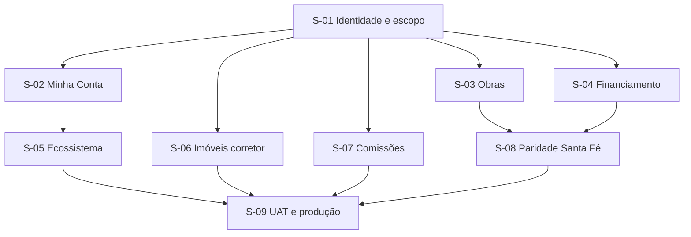

# Plano de execução AIOX — EPIC-016

**Estado atual:** somente planejamento. Nenhuma mudança funcional foi executada.

## Sequência de agentes e gates

| Ordem | Agente AIOX | Saída | Gate |
|---:|---|---|---|
| 1 | @pm | escopo, prioridades e decisões pendentes | Epic aprovado |
| 2 | @architect | arquitetura, contratos de API e impacto | Architecture PASS |
| 3 | @data-engineer | schema, índices, backfill e rollback | Data plan PASS |
| 4 | @sm | stories detalhadas e dependências | Stories Ready |
| 5 | @po | checklist de cada story | GO/NO-GO |
| 6 | @dev | implementação story a story | testes locais aprovados |
| 7 | @qa | segurança, regressão e UAT | QA PASS |
| 8 | @devops | snapshot, migration, deploy e monitoramento | produção estável |

## Ondas de implementação

### Onda 0 — Baseline e decisão

- congelar inventário de rotas, procedures, tabelas e contagens;
- levantar clientes/obras/financiamentos/corretores/comissões sem vínculo;
- confirmar whitelist visual de Obra e Financiamento;
- validar modelo de revisão do imóvel criado por corretor;
- definir retenção e privacidade de documentos.

**Gate:** relatório de baseline e decisões assinadas; nenhuma migration antes disso.

### Onda 1 — Fundação de identidade e escopo

- implementar S-01;
- criar resolvedores de cliente/corretor;
- preparar migrations aditivas e backfill em modo simulação;
- cobrir colisões e perfis incompatíveis.

**Gate:** testes de dois clientes e dois corretores provam isolamento no backend.

### Onda 2 — Portal do Cliente compartilhado

- implementar S-02, S-03 e S-04;
- integrar Obras e Financiamentos ao portal existente;
- eliminar mutações de cliente em Obras;
- adicionar upload somente por solicitação.

**Gate:** cliente A não acessa dados de B alterando URL, payload ou cache.

### Onda 3 — Ecossistema Prospecta

- implementar S-05;
- mover Bilhetes, Saldo e Conversões para a navegação interna do cliente;
- manter redirects temporários das URLs antigas.

**Gate:** contagens antes/depois são idênticas e continuam filtradas por `user_id`.

### Onda 4 — Portal do Corretor

- implementar S-06 e S-07;
- registrar autoria de novos imóveis;
- conciliar comissões legadas sem associação probabilística.

**Gate:** corretor cria imóvel em revisão e visualiza somente suas comissões.

### Onda 5 — Paridade Santa Fé

- implementar S-08 na stack do Grupo Santa Fé;
- repetir matriz de campos, RBAC e testes cruzados;
- registrar formalmente as três exceções exclusivas da Prospecta.

**Gate:** matriz de paridade aprovada nos dois sistemas.

### Onda 6 — Produção

- implementar S-09;
- executar typecheck, testes, build e preview;
- UAT em desktop/iPad/celular com contas reais de teste;
- snapshot dos dois bancos;
- migration/backfill em simulação, aprovação das contagens e execução real;
- deploy gradual, smoke test e monitoramento.

**Gate:** evidências completas e rollback verificável.

## Dependências entre stories

## Estratégia de commits e branches

- partir de `main` atualizado somente após estabilizar/integrar o EPIC-015;
- uma branch do épico e um commit lógico por story;
- migrations em commit próprio;
- evitar implementação concorrente nos mesmos arquivos de navegação, schema e routers;
- não misturar refatorações não relacionadas;
- merge apenas após QA PASS e matriz de paridade atualizada.

## Arquivos de maior risco de conflito

- `client/src/App.tsx`
- `client/src/components/Navbar.tsx`
- `client/src/pages/Portal.tsx`
- `server/portal-router.ts`
- `server/routers.ts`
- `server/financiamento-router.ts`
- `server/operacional-router.ts`
- `drizzle/schema.ts`
- migrations e journal do Drizzle

## Testes mínimos obrigatórios

### Autorização

- cliente sem `lead_id` é bloqueado;
- cliente A não lista nem abre obra/financiamento de B;
- cliente não executa mutation administrativa;
- corretor A não lista comissão de B;
- colaborador não entra nos portais Cliente/Corretor;
- parâmetro `perfil` incompatível não altera o papel.

### Dados

- obra vinculada por lead aparece mesmo sem `user_id` legado;
- financiamento liberado/cancelado não ativa a aba;
- segunda execução do backfill não duplica nem altera contagens;
- comissão legada ambígua permanece pendente;
- dados internos não aparecem no JSON retornado ao cliente.

### Upload

- sem solicitação aberta: bloqueado;
- solicitação de outro cliente: bloqueado;
- MIME falso, extensão falsa, tamanho excedido: bloqueados;
- arquivo válido: persistido com auditoria e visível apenas aos autorizados.

### Interface

- menus corretos por perfil;
- sem atalho global de Obras/Bilhetes/Saldo/Conversões;
- abas condicionais de Obra e Financiamento;
- um único botão Voltar no canto superior esquerdo quando aplicável;
- mobile, tablet e desktop;
- estados vazio, carregando, erro e acesso negado.

## Evidências para fechamento

- inventário antes/depois por tabela e módulo;
- relatório de conciliação e pendências manuais;
- resultados dos testes de isolamento;
- capturas dos três perfis em três viewports;
- build e typecheck;
- URLs de preview e produção;
- identificadores de snapshot/migration/deploy;
- matriz de paridade Prospecta ↔ Grupo Santa Fé;
- roteiro de rollback testado.

